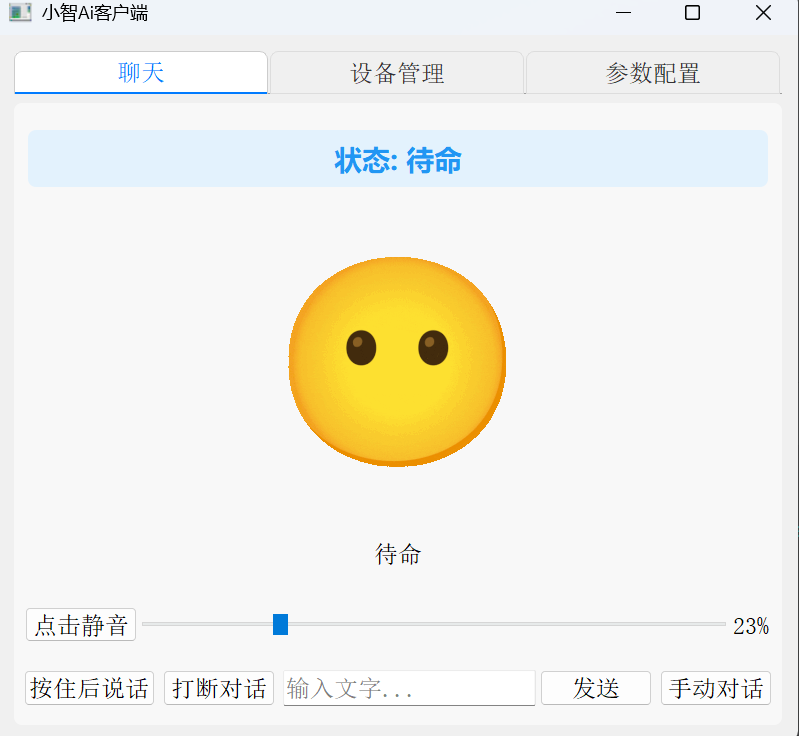

# 语音交互模式说明



## 项目概述

py-xiaozhi是一个智能语音交互助手，支持多种操作模式和功能，包括语音对话、物联网设备控制、视觉识别等功能。本文档主要介绍语音交互的基本使用方法。

## 语音交互模式

语音交互支持两种模式，您可以根据实际需求选择合适的交互方式：

### 1. 长按对话模式

- **操作方法**：按住说话按钮，松手发送
- **适用场景**：短句交流，精确控制对话开始和结束时间
- **优点**：避免误触发，控制精确
- **快捷键**：Alt+Shift+V（按住说话）

### 2. 自动对话模式

- **操作方法**：点击开始对话，系统自动检测语音并发送
- **适用场景**：长句交流，无需手动控制
- **优点**：解放双手，自然交流
- **界面提示**：显示"聆听中"表示系统正在接收您的语音
- **快捷键**：Alt+Shift+A（开始自动对话）

### 模式切换

- 在GUI界面右下角显示当前模式
- 点击按钮可以切换模式
- 通过Alt+Shift+M快捷键切换模式
- 可以通过配置文件设置默认模式

## 对话控制

### 打断功能

当系统正在语音回复时，您可以随时打断：
- **GUI模式**：使用Alt+Shift+X或界面上的打断按钮
- **CLI模式**：使用F3键

## 系统托盘

GUI模式下支持系统托盘功能：

- **状态指示**：托盘图标颜色反映当前系统状态
  - 绿色：已启动/待命状态
  - 黄色：聆听中状态
  - 蓝色：说话中状态
  - 红色：错误状态
  - 灰色：未连接状态
- **最小化**：关闭窗口时自动最小化到系统托盘
- **退出**：右键点击托盘图标选择"退出程序"完全退出应用

### 状态流转

语音交互系统有以下几种状态：

```
                        +----------------+
                        |                |
                        v                |
+------+  唤醒词/按钮  +------------+   |   +------------+
| IDLE | -----------> | CONNECTING | --+-> | LISTENING  |
+------+              +------------+       +------------+
   ^                                            |
   |                                            | 语音识别完成
   |          +------------+                    v
   +--------- |  SPEAKING  | <-----------------+
     完成播放 +------------+
```

- **IDLE**：空闲状态，等待唤醒词或按钮触发
- **CONNECTING**：正在连接服务器
- **LISTENING**：正在聆听用户语音
- **SPEAKING**：系统正在语音回复

## 快捷键一览

| 功能 | 快捷键 | 说明 |
|------|--------|------|
| 按住说话 | Alt+Shift+V | 按住进行录音，松开发送（仅手动模式） |
| 自动对话 | Alt+Shift+A | 开始自动对话（自动检测语音并发送） |
| 打断对话 | Alt+Shift+X | 打断当前AI正在进行的回复 |
| 切换模式 | Alt+Shift+M | 在手动对话/自动对话模式间切换 |

## 语音命令

系统支持多种语音命令，以下是常用命令示例：

### 基础交互
- "你好"/"你是谁" - 基础打招呼和身份询问
- "谢谢"/"再见" - 礼貌用语

### 物联网控制
- "打开/关闭客厅的灯" - 控制灯光
- "播放 菊花台 通过iot音乐播放器播放" - 开始播放音乐

### 视觉识别
- "打开摄像头" - 开启摄像头
- "识别画面" - 分析当前画面
- "识别到了什么" - ai播放识别的内容
- "关闭摄像头" - 关闭摄像头

## 运行模式

### GUI 模式运行（默认）
```bash
python main.py
```

### CLI模式运行
```bash
python main.py --mode cli
```

### 构建打包

使用PyInstaller打包为可执行文件：

```bash
# 各平台通用命令
python scripts/build.py
```

## 平台兼容性说明

- **Windows**: 完全支持所有功能
- **macOS**: 
  - 系统托盘显示在顶部状态栏，而非任务栏
  - 快捷键使用可能需要系统权限授权
- **Linux**: 
  - 系统托盘支持可能因桌面环境(GNOME/KDE/Xfce等)有所不同
  - 部分发行版可能需要安装额外的系统托盘支持包

## 最佳实践

1. **清晰发音**：确保在安静环境中清晰发音
2. **适当停顿**：句子间适当停顿有助于系统识别
3. **使用唤醒词**：开启唤醒词功能，可以避免误触发
4. **查看反馈**：注意界面状态提示，了解系统当前状态
5. **简洁命令**：使用简洁明了的命令获得更好的识别效果

## 获取帮助

如果遇到问题：

1. 优先查看 docs/异常汇总.md 文档
2. 通过 GitHub Issues 提交问题
3. 通过 AI 助手寻求帮助
4. 联系作者(主页有微信)（请自备 Todesk 链接并说明来意，作者工作日晚上处理） 